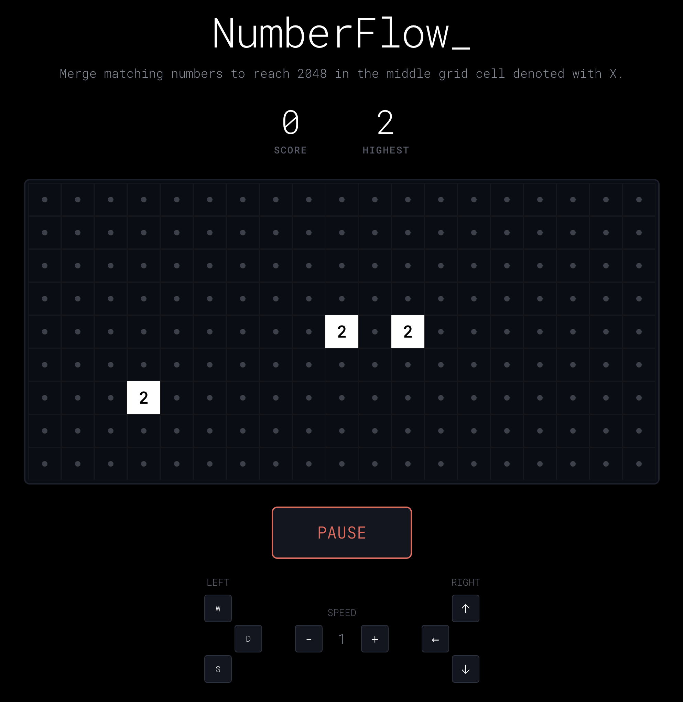

# 🧩 Puzzle Games Arcade

Welcome to my little digital arcade! This is an experimental repository where I design, build, and polish fun little puzzle games. It's a playground for exploring new game mechanics, sharpening my React skills, and creating enjoyable experiences.

Feel free to browse the code, play the games, and see what's new.

---

## 🎮 Now Playing: NumberFlow

The first game in the arcade is **NumberFlow**, a challenging mix of *2048*, *Unify*, and pattern-based puzzle mechanics.

### Gameplay

-   **Objective:** Merge blocks to create a single **2048** tile and win the game.
-   **Flow:** Numbered blocks flow from the left and right edges of the screen towards the center column.
-   **Controls:**
    -   Use **W / S / D** to move the left-hand block.
    -   Use the **Arrow Keys (↑ / ↓ / ←)** to move the right-hand block.
-   **Merging:**
    -   When two blocks with the same number touch, they merge into a new block with double the value.
    -   Chain reactions are possible, so plan your moves carefully!
-   **The Center 'X':** The special `X` block in the center of the grid acts as a gravitational point.
    -   If the center is empty, any block can land there.
    -   If the center has a number, only a block with a matching number can merge with it.
-   **Losing:** The game is over if the blocks stack up and reach the left or right edge of the grid.
-   **Difficulty:** The game's speed automatically increases every minute. Good luck!
